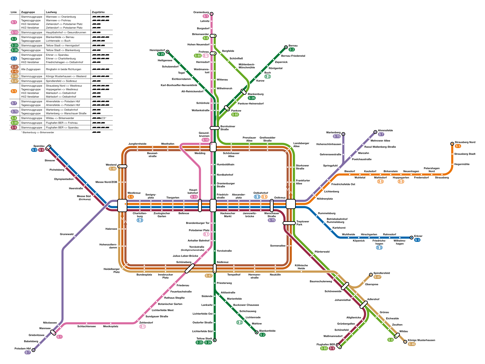
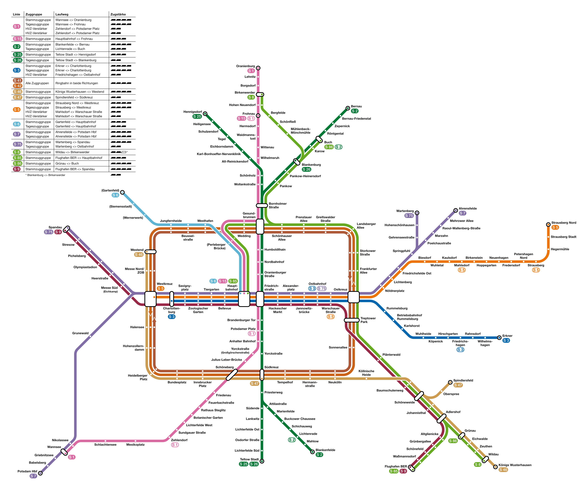
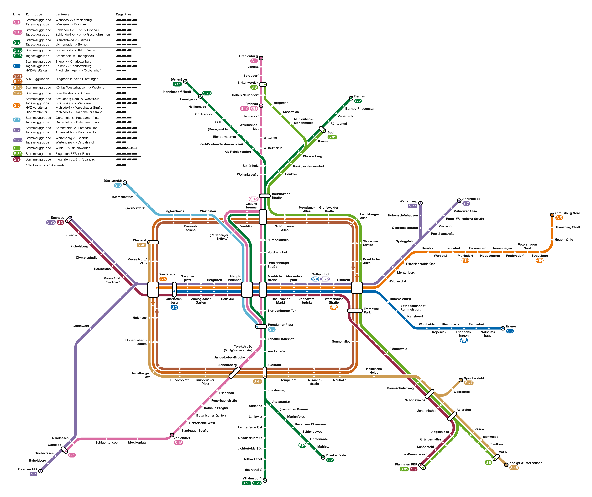
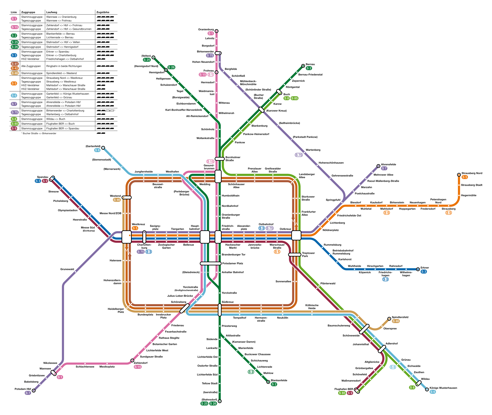

# S-Bahn-Netz Berlin

Das Projekt ist ein kleines Experiment, wie gut Claude Code beim Erstellen von
komplexen Plots funktioniert. Der Großteil des Codes wurde mit Claude Code
erstellt.

Der Plan wird nicht aus Koordinaten gezeichnet, sondern aus einer **Linie als
Folge von Fahrbefehlen**: Startrichtung, Stationen, relative Kurven, starre
(`FixPath`) und elastische (`FlexPath`) Abschnitte. Wo mehrere Linien dieselbe
Strecke benutzen, liegt darunter ein gemeinsamer **Korridor**, der den
Spurversatz vergibt. Die Stationspositionen fallen aus dem Lösen dieses
Systems heraus — verschiebt sich eine Kante, wandert der Rest mit.

Engine-Erklärung: [`engine_description.md`](engine_description.md)

## Erzeugen

```bash
conda env create -f environment.yml && conda activate lineart
```

```bash
python berlin_2026.py && python berlin_2030.py && python berlin_2030plus.py && python berlin_2040plus.py
```

Jede Stufe beschreibt nur den Unterschied zur vorherigen und leitet mit
`Net.derive()` von ihr ab:

```
berlin_2026  →  berlin_2030  →  berlin_2030plus  →  berlin_2040plus
   Bestand      Siemensbahn      City-S-Bahn BA2      Nahverkehrs-
                                 S25, Kamenzer Damm   tangente Nord
```

## Das aktuelle Berliner S-Bahn-Netz, Stand 2026



Vektorfassung: [`outputs/berlin_sbahn_2026.svg`](outputs/berlin_sbahn_2026.svg)

## Zukünftige Stadien des Berliner S-Bahn-Netzes

Die Maßnahmen sind in drei Stufen sortiert, grob nach den möglichen
Fertigstellungsdaten.

### Stufe 1 — Ende der 2020er (`berlin_2030.py`)

- Wiederaufbau der Siemensbahn von Jungfernheide nach Gartenfeld mit den
  Stationen Wernerwerk, Siemensstadt und Gartenfeld
- Neue Station Perleberger Brücke am nördlichen Zulauf zum Hauptbahnhof
- Fertigstellung der endgültigen Station Hbf tief und Ablösung der
  Interimsstation mit ihrem einen Bahnsteig für Halbzüge
- Teilweise zweigleisiger Ausbau der Strecke Hoppegarten – Strausberg

Auf der Siemensbahn fährt die neue Linie S6 von Gartenfeld über den Ring zum
Hauptbahnhof. Die S5 fährt dank des Ausbaus im 10-Minuten-Takt bis
Strausberg. Den Spandauer Ast übernimmt die S75 und fährt von Wartenberg
durch bis Spandau; die S3 endet dafür in Charlottenburg. Neu ist außerdem die
S86 von Grünau nach Buch, sie fährt auf vorhandener Strecke.

Auf der Nordbahn übernimmt die S15 den Laufweg der S85 und fährt vom
Hauptbahnhof bis Frohnau; die S85 endet dafür am Hauptbahnhof, ihr HVZ-Ast
nach Pankow entfällt. S6, S15 und S85 enden hier noch am Hauptbahnhof; der
Tunnel nach Süden kommt erst in Stufe 2.



### Stufe 2 — 2030er Jahre (`berlin_2030plus.py`)

- Fertigstellung des BA2 der City-S-Bahn: Tunnel von Hbf tief bis Potsdamer
  Platz
- Verlängerung der Strecke von Teltow Stadt nach Süden mit den Stationen
  Iserstraße und Stahnsdorf
- Zweigleisiger Ausbau der Kremmener Bahn bis Hennigsdorf, mit der neuen
  Station Borsigwalde
- Verlängerung der Kremmener Bahn nach Norden bis Velten, mit den Stationen
  Hennigsdorf Nord und Velten
- Neue Station Kamenzer Damm auf der Dresdner Bahn
- Zweigleisiger Wiederaufbau der Strecke Buch – Bernau

Mit dem durchgebundenen Tunnel entfallen die Verstärker auf der S1 und die S15
wird von Zehlendorf bis Frohnau verlängert. Die S6 fährt durch den neuen
Tunnel bis Potsdamer Platz. Die S85 fährt statt zum Hauptbahnhof über Pankow
bis Buch, die S86 entfällt. Die Tageszüge der S2 fahren bis Bernau statt nur
bis Buch.

Die S25 fährt künftig von Stahnsdorf über den neuen Tunnel und den
Hauptbahnhof bis Velten. Die S26 wird von der Stettiner Bahn auf die
Kremmener Bahn verlegt und fährt von Stahnsdorf auf dem alten Weg durch den
Nord-Süd-Tunnel bis Hennigsdorf.



### Stufe 3 — 2040er Jahre (`berlin_2040plus.py`)

- Fertigstellung des BA3a und 3b der City-S-Bahn: Verlängerung vom Potsdamer
  Platz über die neue Station Gleisdreieck bis Yorckstraße und Yorckstraße
  (Großgörschenstraße)
- Errichtung der Cheruskerkurve als Verbindung der Stammbahn Richtung Osten
  mit dem Südring
- Bau der Nahverkehrstangente Nord von Wartenberg über die neuen Stationen
  Parkstadt Pankow und Sellheimbrücke zum neuen Kreuzungsbahnhof Karower
  Kreuz an der Stettiner Bahn
- Zwei neue Stationen Bucher Straße und Schönlinder Straße auf dem Berliner
  Außenring

S6 und S15 fahren vom Potsdamer Platz weiter über Gleisdreieck bis Yorckstraße
(Großgörschenstraße), die S15 damit nicht mehr über den Anhalter Bahnhof. Die
S25 nimmt den anderen Ast und fährt von Yorckstraße über Gleisdreieck in den
neuen Tunnel, ebenfalls nicht mehr über den Anhalter Bahnhof. Die S6 biegt
hinter Julius-Leber-Brücke über die Cheruskerkurve auf den Südring ab und
fährt von dort bis Königs Wusterhausen; auf der Görlitzer Bahn übernimmt sie
damit die Funktion der S46. Die S46 fährt deshalb statt nach Königs
Wusterhausen nach Spindlersfeld, die S47 entfällt.

Die S75 fährt über die Nahverkehrstangente bis Birkenwerder und übernimmt
dabei den Nordast der bisherigen S8, die dafür in Buch beginnt. Im Westen
geht der Spandauer Ast zurück an die S3; die S75 endet dort in
Charlottenburg.



Vektorfassung: [`outputs/berlin_sbahn_2040plus.svg`](outputs/berlin_sbahn_2040plus.svg)

### Unrealistische Erweiterungen

Weitere angedachte Erweiterungen sind nicht abgebildet, da die Realisierung nach
heutigem Stand sehr unrealistisch ist:

- Nahverkehrstangente Süd von Altglienicke oder Grünau über den Berliner
  Außenring bis Springpfuhl und weiter auf der geplanten S75 bis Birkenwerder,
  als neue Linie S95 von Flughafen BER bis Birkenwerder. Neue Stationen
  *Glienicker Straße*, *Dörpfeldstraße* (Spindlersfeld),
  *FEZ (Str. An der Wuhlheide)*, *Wuhlheider Kreuz* (Übergang zur S3),
  *Karlshorst Nord*, *Biesdorf Süd*, *Biesdorfer Kreuz* (Übergang zur S5)
- Verlängerung der S-Bahn von Spandau bis Finkenkrug mit den Stationen
  *Nauener Straße*, *Klosterbuschweg*, *Albrechtshof*, *Seegefeld*,
  *Falkensee*, *Finkenkrug*
- Verlängerung der Siemensbahn bis Hakenfelde mit den Stationen
  *Insel Gartenfeld*, *Wasserstadt Oberhavel* und *Hakenfelde*
- Verlängerung der S2 von Blankenfelde bis Rangsdorf mit den Stationen
  *Dahlewitz*, *Dahlewitz-Rolls-Royce*, *Rangsdorf*
- Wiederaufbau der Stammbahn von Zehlendorf bis Griebnitzsee als S-Bahn mit den
  Stationen *Zehlendorf-Süd*, *Düppel-Kleinmachnow*, *Europarc-Dreilinden*

Zweigleisiger Ausbau:

- Frohnau – Oranienburg (S1)
- Wannsee – Potsdam (S7)
- Wildau – Königs Wusterhausen (S46)
