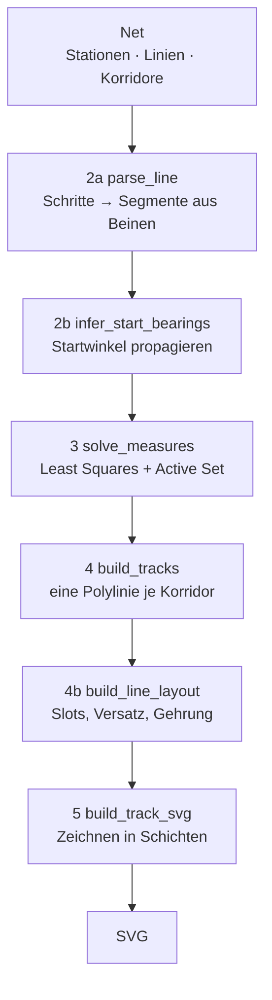

# Die Engine

`netmap/` kennt kein bestimmtes Netz. Sie bekommt eine Definition, löst daraus
die Geometrie und zeichnet sie. Das Berliner Netz lebt komplett außerhalb, in
`berlin_2026.py` und den drei Ausbaustufen darauf.

## Aufbau

| Pfad | Inhalt |
|---|---|
| `netmap/` | die Engine: `model.py` (Datentypen, `StyleConfig`), `solve.py` (Geometrie-Löser), `render.py` (SVG), `legend.py` (Zuggruppen-Tabelle) |
| `berlin_2026.py` | das Netz im Bestand — Stationen, Linien, Korridore, Zuggruppen |
| `berlin_2030.py`, `berlin_2030plus.py`, `berlin_2040plus.py` | die Ausbaustufen, jede als **Differenz** zur vorherigen. Nur was sich ändert, steht darin |
| `outputs/` | die erzeugten SVG- und PNG-Dateien |

Beide Netzskripte nehmen optional einen Zielpfad als Argument.
`write_map(..., draw_corridors=True)` blendet die grauen Hilfstrassen ein —
nützlich, um den Spurversatz gegen die Trassenmitte zu prüfen.

## Die Grundidee

Eine Linie wird **nicht über Koordinaten** definiert, sondern als Folge von
Fahrbefehlen: eine Startrichtung, dann Stationen, dazwischen relative Kurven
und Streckenstücke. Die Koordinaten fallen am Ende heraus.

Schematisch:

```python
TurnLine(
    color=LINE_COLORS["S1"],
    start=45,                          # absolut, 0 = Nord, Vielfache von 45°
    steps=[
        "wannsee", FlexPath(2.0),      # elastisch: der Löser wählt die Länge
        "nikolassee", Turn(45),        # Knick um 45° nach rechts
        "schlachtensee", FixPath(1.6), # starr: exakt 1,6 Gitter-Einheiten
        "mexikoplatz",
    ],
)
```

In `berlin_2026.py` steht die Stationsfolge selbst nicht in der Linie, sondern
in Strecken-Konstanten (`_WANNSEE_BAHN`, `_RING`, `_NORD_BAHN`, …), aus denen
`_slice()` das passende Stück schneidet — siehe „Praktisch" ganz unten.

Das hat zwei Konsequenzen, die den ganzen Rest erklären:

1. **Eine Kante gehört dem Netz, nicht der Linie.** Fahren S1, S2 und S25
   dieselbe Strecke, ist das *ein* physischer Korridor mit *einer* Mittellinie.
   Die Engine erkennt das an der Stationspaarung und prüft, dass alle
   beteiligten Linien dort dieselbe Form beschreiben.
2. **Das Netz ist ein Gleichungssystem, kein Bild.** Wird eine Kante länger,
   wandert alles mit, was daran hängt — inklusive der Linien, die diese Kante
   gar nicht befahren, aber weiter hinten wieder auf eine gemeinsame Station
   treffen.

## Der Weg durch die Engine



Jede Phase ist einzeln aufrufbar und liefert ein eigenes Ergebnisobjekt
(`Network`, `Measures`, `Tracks`, `LineLayout`). `solve_layout()` verkettet 2–4,
`solve_all()` hängt 4b an, `render_svg()` alles.

### Phase 2a — Parsen (`parse_line`)

Die flache `steps`-Liste wird zu **Segmenten** zerlegt: ein Segment ist der Weg
von Station A nach Station B und besteht aus einem oder mehreren **Beinen**
(`LegSpec`). Jedes Bein hat eine Richtung *relativ zum Startwinkel der Linie*
und eine Längenvorgabe (`LengthSpec`: bevorzugt, min, max, Steifigkeit,
Gruppe).

Zwei Stationen ohne Modifier dazwischen ergeben ein Bein mit `line.spacing`.
Ein `Turn` dazwischen ergibt zwei Beine mit einem Knick.

Der **Radius eines Turns ist hier schon Geometrie, nicht Optik**: über seine
Tangente `t = R · tan(δ/2)` belegt der Bogen Platz auf beiden Nachbarbeinen.
Deshalb wird er beim Parsen aufgelöst und geht in Phase 3 als *untere
Längenschranke* ein — eine Kurve kann ein Bein zu kurz machen, und das muss der
Löser wissen. (Darum stehen `curve_radius_*` auch in `NetworkConfig` und nicht
in `StyleConfig`.)

Sonderfall `FixPath(0.0)`: ein Bein der Länge 0 vor einem Turn setzt den Knick
**exakt auf die Station** statt irgendwo zwischen zwei Stationen. Es verschiebt
nichts und zählt deshalb auch nicht zur Form des gemeinsamen Korridors — nur so
kann eine Linie an einem Bahnhof abbiegen, dessen beide Nachbarkanten sie mit
geradeaus fahrenden Linien teilt (in `berlin_2040plus.py` genau der Fall der
S15 am Gesundbrunnen).

### Phase 2b — Startwinkel (`infer_start_bearings`)

Bis hier sind alle Richtungen *relativ*. Jetzt braucht jede Linie einen
absoluten Startwinkel — aber nur wenige stehen in der Definition.

Der Rest wird hergeleitet: Jede Kante, die zwei Linien gemeinsam befahren,
legt die Winkeldifferenz ihrer Startwinkel fest. Daraus entsteht ein Graph, und
von den explizit gesetzten `start`-Werten aus wird per Breitensuche durchs Netz
propagiert. Linien ohne jede Verbindung fallen auf `NetworkConfig.default_start`
zurück.

Dabei wird gleichzeitig **geprüft**: Bevor eine Differenz übernommen wird,
vergleicht die Engine die *Formsignatur* beider Segmente (Beinrichtungen relativ
zum ersten Bein, Elastizität, Längen). Stimmen sie nicht überein, ist der
Korridor in den beiden Linien unterschiedlich beschrieben — Fehler. Läuft eine
Linie die Kante rückwärts, wird spiegelbildlich verglichen. Widersprüchliche
Startwinkel sind ebenfalls ein Fehler, kein stiller Kompromiss.

### Phase 3 — Maße lösen (`solve_measures`)

Das Herzstück. Aufgestellt wird ein lineares Gleichungssystem über zwei Sorten
Unbekannter: die **Koordinaten** aller Stationen (x, y) und die **Längen** aller
elastischen Beine.

Pro Segment eine Gleichung je Achse:

```
p_b − p_a = Σ (Richtungsvektor_j · Länge_j)
```

Starre Beine wandern als Konstante auf die rechte Seite, elastische bleiben als
Unbekannte stehen. `FlexPath(group="…")` bündelt mehrere Beine derselben Linie
auf *eine* gemeinsame Unbekannte — so bekommen z.B. fünf Abschnitte einer
Ringseite garantiert dieselbe Länge, ohne dass man sie ausrechnen muss.

Verankert wird über `TurnLine.anchor`; Netzteile ohne gemeinsame Station
(zusammenhängende Komponenten, per BFS bestimmt) werden deterministisch
nebeneinander gesetzt (`SolverConfig.component_gap`), damit das Ergebnis
reproduzierbar bleibt.

Gelöst wird als **gleichungsbeschränktes Least-Squares-Problem über ein
KKT-System**:

```
[ H   Aᵀ ] [ z ]   [ H · z₀ ]
[ A   0  ] [ λ ] = [   b    ]
```

`A z = b` sind die Segmentgleichungen und Anker (harte Bedingungen), `H` ist
diagonal und gewichtet die Abweichung vom Wunschwert `z₀`. Für ein elastisches
Bein ist das Gewicht `1/flex²` — ein hohes `flex` macht das Bein weich, es gibt
also zuerst nach, wenn irgendwo Platz fehlt. Koordinaten bekommen nur eine
winzige Regularisierung, sie sind praktisch frei.

**Schranken** (`min_length`/`max_length`, und die Kurventangente aus Phase 2a)
sind im KKT-System nicht darstellbar, deshalb läuft außen ein **Active-Set**:
lösen, die am stärksten verletzte Schranke suchen, sie als Gleichung fixieren,
neu lösen — bis nichts mehr verletzt ist. Das terminiert spätestens nach so
vielen Runden, wie es Variablen gibt.

Widersprüchliche Regeln enden hier als `GeometryError` mit dem maximalen
Gleichungsfehler im Text — nicht als krummer Plan.

### Phase 4 — Gleise (`build_tracks`)

Rein rekonstruierend, ohne jede Konfiguration: Aus den gelösten Koordinaten und
Längen wird die Polylinie jedes Streckenabschnitts abgelaufen — **pro
Stationspaar genau einmal**, damit ein gemeinsamer Korridor auch nur eine
Mittellinie hat.

Die Knicke einer Kante entstehen genau einmal, in der gespeicherten Richtung.
Wer sie rückwärts durchfährt, bekommt sie in `_line_path` umgedreht — samt
**Vorzeichen des Drehwinkels**, denn aus einem Rechtsknick wird rückwärts ein
Linksknick. Ohne das korrigierte Vorzeichen zöge `_corner_radius` den Bogen zur
falschen Seite, und eine rückwärts fahrende Linie bekäme im Bündel den Radius
ihres Gegenübers.

Hier bekommt jeder Knick zusätzlich seinen `max_tangent`: wie viel Platz die
Nachbarbeine wirklich hergeben, abzüglich dessen, was ein Knick am anderen Ende
schon belegt. Der Deckel kommt bewusst aus der *Mittellinie* und gilt für alle
Spuren gleich — sonst wären die Bögen eines Bündels nicht mehr konzentrisch.

Zum Schluss wird geprüft, dass der abgelaufene Weg wirklich bei `coords[seg.b]`
ankommt. Tut er das nicht, ist die Rekonstruktion inkonsistent — Fehler.

### Phase 4b — Linienführung und Bündelung (`build_line_layout`)

Bis hier gibt es nur Trassenmitten. Jetzt bekommt jede Linie ihre eigene Spur.

- **Slots** werden pro **Familie** vergeben, nicht pro Linie. S1/S15, S2/S25/S26,
  S8/S85, S46/S47 teilen sich einen Platz und liegen auf gemeinsamen Abschnitten
  *übereinander* statt nebeneinander (`TurnLine.family`).
- Benachbarte Kanten werden zu **Strecken** verschmolzen (Union-Find), wenn sie
  an einer Station geradeaus ineinander übergehen *und* von genau derselben
  Familienmenge befahren werden. Der Slot bleibt dann über die ganze Strecke
  gleich, statt an jeder Station neu zu springen. Endet nur eine Variante,
  während ihre Stammlinie weiterläuft, ändert sich die Familienmenge nicht — das
  Bündel bleibt ruhig.
- Innerhalb einer Strecke werden die Familien sortiert und um die Mitte
  zentriert (Slot 0 = Trassenmitte).
- **`Corridor` schlägt die Automatik.** Wo die berechnete Reihenfolge nicht
  passt, legt ein Korridor die Spurlagen von Hand fest (`offsets` je Linie oder
  Familie). `start_offsets` gilt für Linien, die auf der Kante erst *beginnen*;
  `immediate` lässt den Spurwechsel schon auf gerader Strecke passieren statt
  erst in der nächsten Kurve, `shift_at` bestimmt wo auf dem Bein. Eine Linie,
  die einen Korridor befährt, dort aber weder über ihre Familie noch über ihre
  ID gelistet ist, ist ein Fehler — sonst rutscht eine neu hinzugefügte Linie
  unbemerkt an den Rand.
- Die versetzte Polylinie wird auf **Gehrung** gesetzt: die parallel
  verschobenen Beine werden verlängert und geschnitten, damit die Spuren in der
  Kurve parallel bleiben.
- Der Bogenradius wird um den Versatz korrigiert — innen enger, außen weiter.
  Maßgeblich ist die **Mitte aus der Spur vor und hinter dem Knick**, nicht die
  davor: „davor" liegt für zwei gegenläufige Linien an entgegengesetzten Enden
  desselben Bogens. Wechselt das Bündel dort die Spur, nähme jede ihren Wert
  von ihrer Seite — zwei Linien, die durchgehend eine Spur nebeneinander
  laufen, bekämen dann Radien, die um den ganzen Spurwechsel auseinanderliegen.
  Der Mittelwert ist richtungsunabhängig und fällt bei gleichbleibender Spur
  ohnehin mit ihr zusammen.
- Die Korrektur greift **nur wo im Bogen wirklich ein Nachbar danebenläuft**. Maßgeblich ist,
  ob eine andere Familie den Knick mit gleichbleibendem Abstand mitfährt; das
  ist auch erfüllt, wenn das ganze Bündel gemeinsam umschwenkt. Fährt eine
  Linie den Bogen allein — oder wechselt sie dort, wie S8 und S9 am Treptower
  Park, von einem Bündel ins andere —, gibt es niemanden, zu dem sie
  konzentrisch sein müsste: sie behält den Default-Radius.

### Phase 5 — Zeichnen (`build_track_svg`)

Erzeugt **keine Geometrie mehr**. Ein Layout lässt sich einmal lösen und mehrfach
verschieden rendern; an der Signatur ist das ablesbar, weil hier nur noch
`StyleConfig` hereinkommt und nicht das ganze `Config`.

Gezeichnet wird in Schichten, in dieser Reihenfolge:

1. die farbigen Linienzüge (innerhalb einer Familie die Stammlinie zuletzt,
   damit sie obenauf liegt)
2. Ummantelungen an Kreuzungen ohne Umsteigebeziehung, damit erkennbar bleibt,
   welche Linie oben läuft
3. Stationspunkte — einer **je Linie an deren Spur**, nicht einer auf der
   womöglich leeren Trassenmitte
4. Hub-Pillen quer über das Bündel
5. Endpunktringe und Linien-Signets
6. Beschriftungen
7. optional die grauen Hilfstrassen (`draw_corridors`)
8. die Zuggruppen-Tabelle (`legend_at`)

Signete stehen an den Endpunkten jeder Linie. Eine Ausnahme ist der **Zweig**
(`TurnLine.branch_of`): ein zweiter Streckenzug derselben Linie, der irgendwo
auf sie trifft — gedacht für einen zeitweisen Laufweg, etwa die S85, die
außerhalb der HVZ nicht bis Frohnau fährt, sondern ab der Bornholmer Straße
nach Pankow. Eine `TurnLine` ist EIN Streckenzug, zwei Nordenden passen nicht
hinein. Ein Zweig trägt das Signet seiner Stammlinie und zeigt es nur an seinem
freien Ende; an dem Ende, mit dem er auf die Stammlinie trifft, gibt es weder
Signet noch Endpunktring noch Hub-Punkt. `_resolve_branches` in Phase 2 prüft,
dass genau eines der beiden Enden auf der Stammlinie liegt.

Die Beschriftung ist weitgehend automatisch: Die Vorzugsseite ergibt sich aus
der Trassenrichtung, an waagerechten Trassen wechseln die Namen ab, an
senkrechten stehen sie links, sofern dort nichts im Weg liegt. Was die Automatik
nicht trifft, korrigiert die Netzdefinition punktuell über `label_pos`,
`label_offsets`, `badge_offsets`, `badge_opposite_corner` oder — ganz manuell —
`label_override`. Für die Signetreihe an einem Endbahnhof gibt es dazu
`badge_above` (über dem Namen statt darunter) und `badge_order` (Reihenfolge der
Signete, sonst alphabetisch).

Die Zeichenfläche wird nicht aus den Trassen berechnet, sondern **jedes
gezeichnete Element meldet seine Ausdehnung an**. Deshalb wächst die Karte
korrekt mit, wenn ein langer Name oder die Legende außen übersteht. Zum Schluss
wird auf ganze Pixel nach außen gerundet, damit `width`/`height` und `viewBox`
exakt übereinstimmen.

### Die Legende (`legend.py`)

Eine eigene Schicht, die nur liest, was ohnehin in den Linien steht
(`TurnLine.groups`). Sie liefert fertige SVG-Elemente **plus ihren Umriss**, den
der Renderer wie jedes andere Element anmeldet. Spaltenbreiten ergeben sich aus
dem längsten Eintrag, die Zugstärke steht als Viertelzüge in der letzten Spalte.
Position: `legend_at` im `Net(...)`, `None` = keine Legende. Steht dort nur die
linke Kante und als Höhe `None` — `legend_at=(-60.0, None)` —, sucht der Renderer
die Höhe selbst: die Tabelle hängt so tief, dass unter ihr derselbe Abstand
bleibt, den der Rahmen ringsum lässt (`style.margin`). Weil sie über den Nordrand
der Karte hinausragt, ist das zugleich die kürzeste Karte. Dafür melden die
Streckenzüge ihren Umriss segmentweise an und nicht als einen Kasten um die
ganze Linie — sonst läge über der halben Karte ein Kasten und keine Fläche wäre
mehr frei.

## Konfiguration

Drei Blöcke unter einem Dach (`Config`, Instanz `CFG`) — die Trennung ist die
inhaltlich wichtigste Konvention der Engine:

| | wirkt in | Beispiele |
|---|---|---|
| `NetworkConfig` | Phase 2 | `default_start`, `min_gap_default`, `curve_radius_45/90/135`, `shift_bezier` |
| `SolverConfig` | Phase 3 | `component_gap`, `coordinate_regularization`, `constraint_tolerance` |
| `StyleConfig` | Phase 5 | `grid`, `margin`, Linienbreiten, Schrift, `bundle_spacing`, alle `legend_*` |

**`StyleConfig` ändert nie die Geometrie.** Diese Werte lassen sich anpassen und
neu rendern, ohne neu zu lösen. Alles, was Platz auf einer Strecke verbraucht —
allen voran der Kurvenradius — gehört deshalb bewusst nach `NetworkConfig`.

## Einheiten

Der Löser rechnet in **Gitter-Einheiten**; `spacing`, `FixPath`-Längen und
Kurvenradien sind alle in dieser Größe. Erst Phase 5 skaliert mit
`StyleConfig.grid` (28 px) in Pixel. Ausnahmen sind die Feinkorrekturen der
Beschriftung und `legend_at` — die stehen direkt in Pixeln, weil sie sich auf
Schriftgrößen beziehen und nicht auf Stationsabstände.

## Wenn etwas nicht aufgeht

Die Engine rät nicht, sie wirft `GeometryError`. Die häufigsten Fälle und was
sie bedeuten:

| Meldung | Ursache |
|---|---|
| „Gemeinsamer Korridor … hat unterschiedliche Geometrie" | Zwei Linien beschreiben dieselbe Kante verschieden — andere Länge, anderer Turn, anderes `FlexPath` |
| „Widersprüchliche Startwinkel für …" | Zwei gesetzte `start`-Werte passen über die gemeinsamen Kanten nicht zusammen |
| „Die Linienregeln sind geometrisch widersprüchlich" | Phase 3 findet keine Lösung — meist zu viele starre Längen auf einem geschlossenen Weg |
| „Längengrenzen konnten nicht gelöst werden" | Das Active-Set konvergiert nicht; min/max sind irgendwo unerfüllbar |
| „Korridor '…': … fährt A -> B, hat aber keinen Versatz" | Eine Linie wurde ergänzt, der Korridor nicht nachgezogen |
| „Korridor '…': A -> B ist keine Kante im Netz" | Ein Korridor nennt ein Stationspaar, das keine Linie so befährt |

## Ausbaustufen: `Net.derive`

Ein späteres Netz beschreibt nur den **Unterschied** zum vorherigen.
`Net.derive()` erbt alle neun Felder von `Net`; genannt wird nur, was sich
ändert:

```python
VORGAENGER = bestand.NET

NET = VORGAENGER.derive(
    stations=[*RESTYLED_STATIONS, *NEW_STATIONS],
    lines={**CHANGED_LINES, "S26": REMOVE},
    groups=GROUPS,
    corridors={**SIEMENSBAHN_CORRIDORS, ...},
    legend_at=(-60.0, None),
)
```

Jedes Abbildungsfeld kennt dieselben drei Fälle — eine neue ID legt an, eine
bekannte ersetzt, `REMOVE` nimmt heraus. `stations` darf statt einer Abbildung
auch eine Liste von `Station` sein (die ID steht ja in der Station),
`badge_opposite_corner` und `badge_above` sind Mengen (Iterable fügt hinzu,
Abbildungsform erlaubt `REMOVE`), und `legend_at` erbt ohne Angabe.

Zwei Dinge daran sind Absicht:

- **Vergessen ist unmöglich.** Beim Zusammenbauen von Hand fiel ein nicht
  genanntes Feld still auf seinen Default zurück, statt geerbt zu werden — ein
  neues `Net`-Feld hätte man in jeder Stufe nachziehen müssen. `derive` erbt
  von sich aus alles, was es nicht kennt.
- **`REMOVE` auf einen unbekannten Schlüssel ist ein Fehler.** Sonst
  verschwindet ein Tippfehler unbemerkt und man sucht später, warum das
  Entfernen nichts bewirkt hat.

`groups` ist der einzige Sonderfall: es setzt die Zuggruppen **aller** Linien
neu, weil die Legendentabelle zum Ausbaustand gehört und nicht zur geerbten
Linie. Wer dort fehlt, taucht in der Tabelle nicht auf.

Ableitungen lassen sich **ketten** — genau so hängen die Netzdateien
zusammen: `berlin_2026` → `berlin_2030` → `berlin_2030plus` →
`berlin_2040plus`, jede leitet von ihrem Vorgänger ab. Damit die Stufe wirklich auf ihrem Vorgänger sitzt
und nicht auf dem Bestand, greifen die Helfer einer Netzdatei (`_extend`,
`_restyle`) über die eine Konstante `VORGAENGER` zu. Davon zu unterscheiden
sind die **Bausteine** — `_RING`, `_slice()`, die `_KURVE_*`-Konstanten: die
sind für jede Stufe dieselben und kommen weiter direkt aus `berlin_2026`.

## Praktisch: eine Änderung machen

Eine neue Station auf einer bestehenden Strecke einzufügen heißt: `Station`
anlegen, in die `steps` der Linie schreiben — **und in die aller Linien, die
diese Kante mitbenutzen**, mit identischer Längenbeschreibung. Sonst meldet
Phase 2b sofort unterschiedliche Geometrie. Deshalb stehen die
Strecken-Konstanten in `berlin_2026.py` (`_RING`, `_NORD_BAHN`, …) einmal
zentral und werden per `_slice()` in die einzelnen Linien geschnitten.

`berlin_2040plus.py` treibt das weiter: Es beschreibt sein Netz als Differenz
zum Bestand (`_extend`, `_insert_after`, `_splice`, `CHANGED_LINES`,
`DROPPED_LINES`). Eine Korrektur in `berlin_2026.py` — ein verschobener Spurversatz,
ein besseres `label_pos` — wirkt damit automatisch auf beide Karten.
